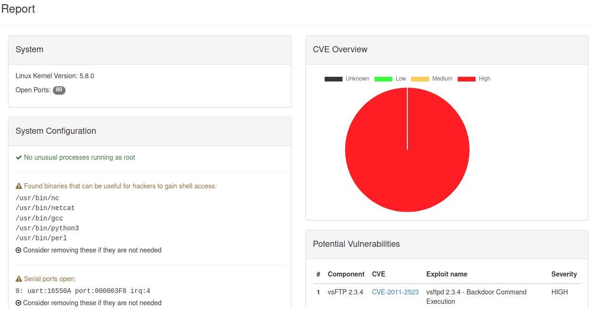

# FirmwareCheck

[](https://scratch-itea3.eu/)

[](https://www.itea3.org)

FirmwareCheck is a tool for automated dynamic security analysis of firmware images generated by [buildroot](https://buildroot.org/). Running in a CI-pipeline, it allows developers to identify security risks while developing IoT-firmware.
FirmwareCheck emulates the firmware using [QEMU](https://www.qemu.org/).

In order to be able to run on as many systems as possible, dependencies are low on the side of the analyzed system, and any system with `sh` and core linux utils should be able to run FirmwareCheck.

An integration in a CI-pipeline looks like this:
* 🔧👷 Generate a firmware image with buildroot
* ✅❌ Run checks on generated firmware
* 🆗🔧 Release firmware if checks have passed

### Features
A firmware is scanned for typical IoT security issues, including:
* Outdated Components (CVEs)
* Open Serial Ports (Debug-Ports)
* Default passwords or anonymous logins on Databases
* Open Ports
* Processes running as root
* Executables that can be used by a hacker to get a reverse shell on a device

FirmwareCheck can also be used on a live system, for hardening purposes.

### Usage 

##### If you are using buildroot (in CI) to generate a firmware:
<details>
    <summary>Click here</summary>

## Continous Integration

An example Setup for [drone.io](https://www.drone.io/) pipelines sits under [.drone.yml](.drone.yml).
    
In general the steps will be as following:
    
* Build firmware with buildroot and enable the serial shell in build to allow FirmwareCheck to access the firmware. 
    * To do this, you have to go into the Buildroot configuration, in System configuration, modify Run a getty (login prompt) after boot and set the appropriate port and baud rate in the getty options submenu. This will automatically tune the /etc/inittab file of the generated system so that a shell starts on the correct serial port.
    * The board you are generating the firmware for has to be supported by QEMU in order to have buildroot generate the necessary `run_qemu.sh` file.
* Let FirmwareCheck run after the image has been generated. The `--ports` parameter specifies ports that are allowed to be open, otherwise the Pipeline fails.
    * The image can be pulled from `srath/firmware_check:latest` or you can build your own using the [Dockerfile](./CI/Dockerfile).
* Build firmware again if the check passes, this time without the debug port, ready for release

</details>


##### If you want to harden a Linux-system:

<details>
  <summary>Click here</summary>

## On a live system

##### Dependencies
Install the following dependencies on your host (not the system analyzed). 

If you are using kali linux:

```bash
pip3 install -r requirements.txt
sudo apt install linux-exploit-suggester exploitdb wkhtmltopdf`
```

For ubuntu/debian/other, you need to install exploitdb and linux-exploit-suggester yourself. The easiest way is to add the kali repositories in ubuntu and import the signing keys:

```bash
sudo apt install gnupg
wget 'https://archive.kali.org/archive-key.asc'
sudo apt-key add archive-key.asc && rm archive-key.asc
sudo sh -c "echo 'deb https://http.kali.org/kali kali-rolling main non-free contrib' > /etc/apt/sources.list.d/kali.list"
sudo apt update
```

##### Run

To analyze a live Linux system:

1) Run `firmware_check_yml.sh` on target Linux IoT device

In addition, If you want to generate a html/pdf report:

2) Get the output file `fc_output.yaml` or copy its contents to your host
3) Run `generate_report.py <path to fc_output.yaml>` to get a report
</details>

### Screenshot



### Test on a local docker container
An example vulnerable container exists and can be run via:

`sudo docker build . -t vulnerable_firmware && sudo docker run -it vulnerable_firmware:latest /bin/bash` 

Then follow the above steps described under "On a live system".

## Credits
* buildroot (https://buildroot.org/)

* QEMU (https://www.qemu.org/)

